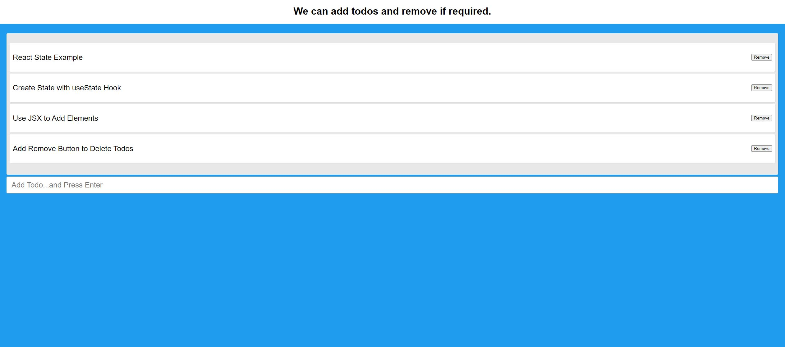

# Todo 

## Description of the Project:
#### Add or delete todos
## How to Run: 
Enter details in the text area and press enter to create a new todo. We can remove existing todos as needed.

Contact details: gv68682@gmail.com
## Code Details:
Used spread operator to add newly created todo to the existing todo list. With the help of React useState hook, captured the latest todo value and rendered to the DOM.

